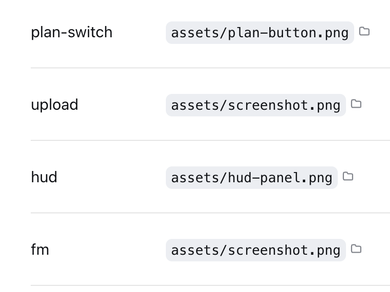
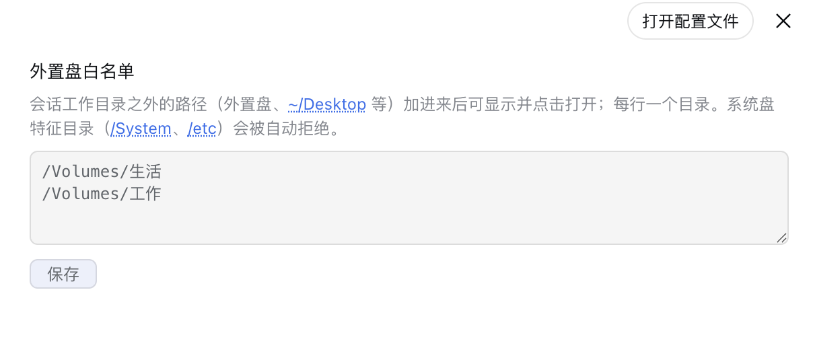

# dsh-file-mentions 📎

[English](README.md) | [简体中文](README.zh-CN.md)


[](https://awesome-dsh-plugin.com)

**回复里提到的文件/路径，点一下就打开** —— DeepSeek Harness（DSH）web 插件，Codex 式体验。

*非官方项目：社区成员独立开发维护，非 DeepSeek 官方产品。*

## 截图



回复正文里反引号包着的路径（`~/...`、绝对路径、相对路径、中文路径）**直接点击就能打开**；
每个可点路径后面自动带一个文件夹图标小按钮，进文件管理器定位；回复尾部还有"📎 提到的文件"
小圆钮兜底。URL 链接由官方渲染器自动可点，无需本插件处理。



外置盘白名单（设置 → 插件 → 文件提及）：会话工作目录之外的路径（外置盘、`~/Desktop` 等）
加进来后可显示并点击打开——每行一个目录。系统盘特征目录（`/System`、`/etc`）会被自动拒绝。

## 功能

| 位置 | 操作 | 效果 |
|---|---|---|
| 正文路径文字 | 点击 | 文件用系统默认应用打开 / 目录打开窗口 |
| 正文路径后的文件夹图标 | 点击 | 文件管理器定位选中 |
| 回复尾部"📎 提到的文件" | 点文件名 | DSH 内预览文件内容 |
| 回复尾部文件夹图标 | 点击 | 文件管理器定位选中 |
| 正文 URL | 点击 | 浏览器打开（官方 autolink） |

支持 `~/` 展开、相对路径（按会话目录解析）、macOS/Linux/Windows 三种绝对路径形态；
不存在的路径点击后静默无反应（不报错、不弹窗）。

## 安装

本仓库是官方 **bundle 插件**格式（根 `package.json` 的 `dsh.bundle` + `dsh.client`），
经官方 profile 管理一行安装：

```sh
dsh plugin --profile web add "github:a903067276-rgb/dsh-file-mentions#main"
```

装完**重启 `dsh web`**（bundle 层在启动时合成，热更新无效）。需要 pnpm
（`dsh plugin` 是 pnpm 转发器）。

手动挂载兜底：见 [docs/install.md](docs/install.md)。

## 用法

agent 回复里用反引号包路径（如 `` `~/docs/计划.md` ``）即可触发正文点击。
尾部列表自动出现，无需配置。

### 会话目录之外的路径（外置盘等）

出于安全考虑，绝对/`~/` 路径只在**当前会话工作目录内**做存在性探测。要让外置盘
（如 `/Volumes/U盘名`）或其它工作目录之外的路径可显示、可点击打开，把它加进
**外置盘白名单**：设置 → 插件 → 文件提及（每行一个目录）。保存立即生效，无需重启。

系统盘保护：白名单根下若检测到系统特征目录（`/System`、`/etc`，Windows 为
`\Windows`），该根会被自动拒绝——误把整块系统盘加进白名单也开不了门。

## 平台支持

| 平台 | 状态 |
|---|---|
| macOS | ✅ 全功能实测（含中文路径） |
| Linux | ⚠️ 未实测；架构上预期可用（命令分流与路径解析已实现） |
| Windows | ⚠️ 未实测；架构上预期可用（命令分流与路径解析已实现） |

## 环境要求

- DSH web（≥ 0.1.0-rc.6）（`npx @deepseek-ai/dsh web` 启动）
- **版本兼容**：0.1.0-rc.6 及以上（含 0.1.1-rc.1/rc.2）——直接安装 `main` 即可；设置卡片通过双字段注册同时满足 rc.6（id 契约）与 rc.7+（key 契约）；`rc6-compat` 冻结标签已退役（仅作历史标签保留）。
- 纯 Node 标准库实现；peer 依赖（`@deepseek-ai/dsh-settings`、`@deepseek-ai/schemastery`）
  由宿主提供
- 打开文件调用系统默认应用 / 文件管理器（按平台分流命令）

## 工作原理

- **Host**（`lib/index.js`）：三条路由 —— `/api/file-mentions/check`（存在性验证）、
  `/api/file-mentions/open`（系统打开，`mode: open/reveal`，平台命令分流）、
  `/api/file-mentions/config`（白名单读写，设置页用，同源校验防 CSRF）。
  探测面：绝对/`~/` 路径只在本会话 cwd 内或用户声明的白名单根内探测（白名单走官方
  settings 服务，保存即生效、无需重启）；白名单根带系统盘保护与 symlink 防逃逸。
  全部 Node 标准库，`execFile` 不经 shell 防注入。
- **Client**（`lib/client.js`）：conversationEvents 收集器提取每轮回复里的路径 →
  发布到回合数据 → 尾部列表渲染前先过滤不存在的路径；正文可点用 **document 点击委托**
  （官方渲染入口被官方"产物"插件占用，无法扩展，这是唯一可行路径）；正文文件夹图标按钮用
  MutationObserver 动态补插，React 重渲染自动恢复；设置卡片（侧边栏分区 + 插件页）
  编辑白名单。

详见 [docs/architecture.md](docs/architecture.md)。

## 注意事项

- bundle 安装与手动挂载**二选一**，不要同时用。
- 手动挂载时 `~/.dsh/cordis.patch.yml` 只加**单 entry**；双 entry 会让插件应用两次、
  路由重复注册崩溃。

## 兼容性说明

- 正文可点依赖"反引号包裹的路径"（与 Codex 一致的 agent 输出惯例）；裸路径正文
  不支持（防误点普通文字）。
- 官方"产物"列表与本插件互不打架：官方有产出时优先，无产出时本插件显示。
- Windows / Linux 欢迎实测后提交 issue/PR 补充验证。

## 许可证

[MIT](LICENSE)
